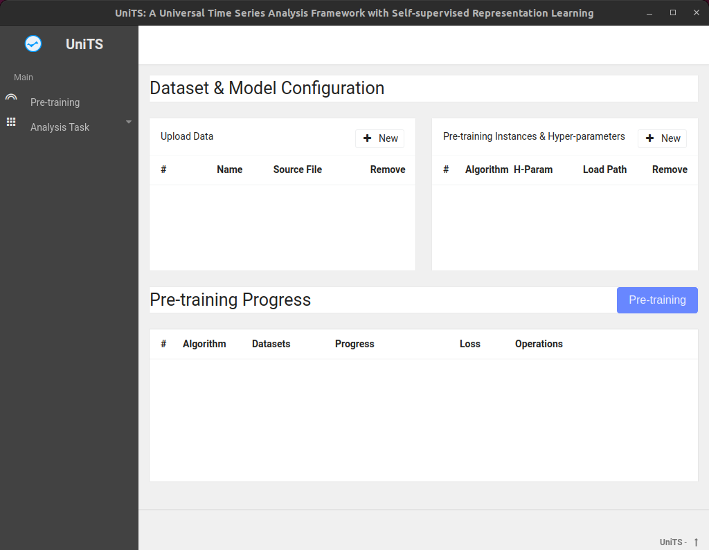

## Official Implementation of "UniTS: A Universal Time Series Analysis Framework with Self-supervised Representation Learning".
UniTS is a powerful framework for time series analysis that incorporates self-supervised representation learning to address practical challenges such as partial labeling and domain shift. With UniTS, users can easily perform analysis tasks using user-friendly GUIs and benefit from its convenience. The components of UniTS are designed with sklearn-like APIs, allowing for flexible extensions. This project's GitHub repository provides access to the UniTS framework and related resources.

### How to Install?
1. Install [miniconda](https://docs.anaconda.com/anaconda/install/linux/).
2. Simply rum `bash env.sh` and waiting for the environment to be installed.

Just run `python app.py` in the created python environment "UniTS". You should see the GUI as shown in the image below.

### Notice
Running on Ubuntu, some changes will be added recently to make the software run on Windows.